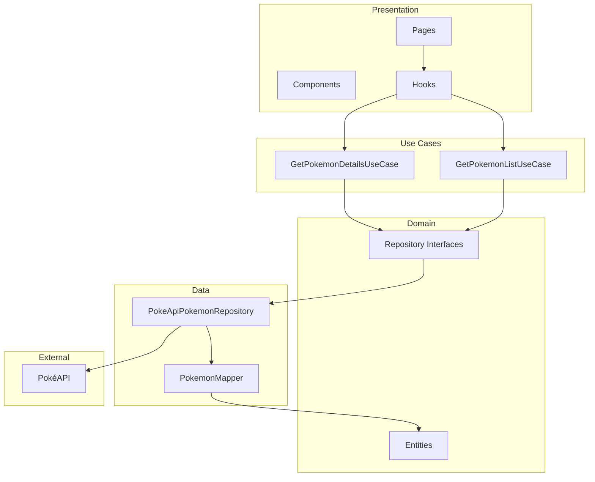

# Arquitetura do Projeto

## Visão Geral

O projeto segue **Clean Architecture** com camadas bem definidas: Domain, Data, UseCases e Presentation. A UI nunca conhece a API externa; os Mappers são a ponte entre o mundo real e o domínio.

## Estrutura de Camadas

### Domain

- **Entidades puras**: `IPokemon`, `IPokemonListItem`, `IEvolutionChainNode`, etc.
- **Interfaces de repositório**: `IPokemonRepository` define o contrato sem implementação.
- **Sem dependências externas**: o domínio não conhece HTTP, React ou qualquer framework.

### Data

- **Repositório**: `PokeApiPokemonRepository` implementa `IPokemonRepository` e consome a PokéAPI.
- **Mappers**: transformam DTOs da API em entidades do domínio (`mapPokemonListResponse`, `mapPokemonDetails`, `mapEvolutionChain`).
- **UseCases**: orquestram a lógica de negócio e delegam ao repositório.

### Presentation

- **Componentes React**: páginas, listas, cards, modais, filtros.
- **Hooks**: `usePokemonList`, `usePokemonDetails`, `usePokemonFilters`, `useEvolutionChain`.
- **Consome apenas UseCases** via injeção de dependência (`di.ts`).

## SOLID na Prática

### S — Single Responsibility

- **PokemonMapper**: única responsabilidade de transformar DTOs em entidades. Cada função mapeia um aspecto específico (sprites, stats, abilities, flavor texts).
- **Cada UseCase**: uma única ação (`GetPokemonListUseCase` lista, `GetPokemonDetailsUseCase` busca detalhes).

### D — Dependency Inversion

- UseCases dependem de `IPokemonRepository` (interface), não da implementação concreta.
- Injeção via `di.ts`: o repositório é instanciado uma vez e passado aos UseCases.
- Testes usam `MockPokemonRepository` sem alterar os UseCases.

### O — Open/Closed

- **pokemon-type-colors** e **pokemon-color-gradients**: extensíveis por novos tipos sem alterar código existente. Novos tipos são adicionados em objetos de configuração.
- **FilterPanel**: novos filtros podem ser adicionados sem modificar a estrutura existente.

## Padrões de Projeto

### Mapper

Isola a UI da "sujeira" da API externa. A PokéAPI retorna estruturas aninhadas, nomes em snake_case e formatos inconsistentes. O Mapper:

- Normaliza nomes (`front_default` → `frontDefault`)
- Aplica fallbacks (imagem padrão, descrição padrão)
- Extrai e deduplica flavor texts
- Transforma evolution-chain em árvore recursiva

### UseCase

Centraliza a regra de negócio. O `GetPokemonDetailsUseCase` orquestra a busca: o repositório internamente chama `getPokemon` e `getPokemonSpecies` em paralelo via `Promise.all`, e o Mapper unifica os dados.

## Por trás dos panos

### Otimização com Promise.all

- **Listagem com filtros**: busca em paralelo por tipo (OR entre tipos), geração, cor e habitat. Depois, batch-fetch dos Pokémon da página em paralelo.
- **Detalhes**: `pokemon` e `species` em paralelo (`Promise.all([getPokemon, getPokemonSpecies])`).
- **Busca por nome**: fetch da lista completa (`limit=10000`), filtro em memória, depois batch-fetch da página.

### URL como Single Source of Truth

- `usePokemonFilters` lê `searchParams` (page, search, types, minAtk, maxAtk, minExp, maxExp, generation, color, habitat).
- Qualquer alteração de filtro atualiza a URL com `router.replace(..., { scroll: false })`.
- Compartilhamento de estado: refresh da página mantém os filtros. Navegação para detalhes e volta preserva busca e página.

### Cache

- TanStack Query com `staleTime: 30_000` (30 segundos) em `query-client.ts`, atendendo ao requisito de cache mínimo.
